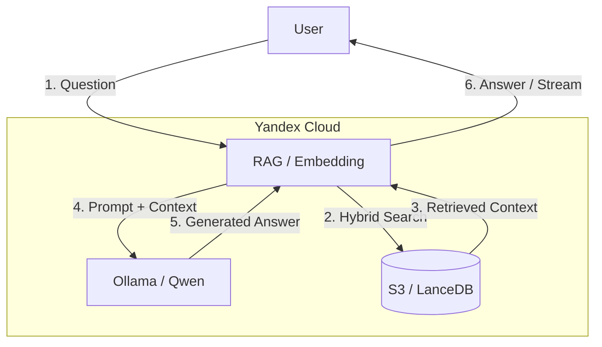

# High-Speed CPU-based RAG Assistant (LLM Zoomcamp 2026 Project)

[](https://www.python.org/)
[](https://fastapi.tiangolo.com)
[](https://lancedb.com)
[](https://www.docker.com/)
[](https://kubernetes.io/)
[](https://www.terraform.io/)
[](https://github.com/astral-sh/uv)

An end-to-end, high-speed Retrieval-Augmented Generation (RAG) service optimized for CPU inference. The system indexes document knowledge bases, stores vector embeddings in Yandex Cloud S3 via LanceDB, performs hybrid search, and streams answers using local LLM runtimes (Ollama with Qwen2.5-1.5B) inside Yandex Managed Service for Kubernetes.

Built as a capstone project for the **[DataTalks.Club LLM Zoomcamp 2026](https://github.com/DataTalksClub/llm-zoomcamp)**.

---

## Problem Description

Navigating large technical documentations, manuals, and internal knowledge bases can be slow and inefficient. Standard general-purpose LLMs often suffer from hallucinations when answering domain-specific questions or lack access to up-to-date private documents.

**The Solution:**
This project provides an automated, low-latency, end-to-end RAG architecture deployed in Yandex Cloud that:
1. Ingests domain PDF/text documents into a structured vector database.
2. Uses **Hybrid Search** (combining dense vector search with sparse text search) to achieve high recall and precision.
3. Serves low-latency streaming answers (Server-Sent Events / SSE) over a high-performance **FastAPI** backend using an **Ollama (`qwen2.5:1.5b`)** engine deployed inside Kubernetes.
4. Leverages **Yandex Cloud S3 Object Storage** as a persistent storage layer for LanceDB vector indexes.

---
## System Architecture




## Tech Stack & Tools

- LLM Runtime: Ollama running qwen2.5:1.5b (local CPU inference, lightweight & fast).
- Embedding Model: BAAI/bge-small-en-v1.5 via fastembed (ONNX-accelerated CPU embeddings).
- Vector Database: LanceDB connected to Yandex Cloud S3 (s3://...).
- Backend / API Framework: FastAPI + httpx (Asynchronous HTTP client) + uvicorn.
- Package & Dependency Management: uv (pyproject.toml).
- Containerization & Deployment: Docker, docker-compose, and Kubernetes (k8s/ manifests).

## Repository Structure

```
.
├── app/
│   ├── main.py              # FastAPI REST API (/query, /stream, /metrics, /feedback)
│   └── ui.py                # Streamlit Web User Interface
├── data/                    # Raw input PDF documents
├── img/                     # Images/screenshots used in README.md
├── infra/                   # Infrastructure configuration (Terraform for Yandex Cloud)
├── k8s/                     # Kubernetes manifests (RAG, LLM, Monitoring stack)
├── notebooks/               # RAG and LLM evaluation notebooks
├── scripts/                 # Data ingestion, indexing, and benchmark scripts
├── Dockerfile               # Production build recipe for FastAPI backend
├── Dockerfile.streamlit     # Dedicated container build for Streamlit UI
├── docker-compose.yaml      # Multi-container setup for local development
├── requirements.txt         # required python modules for RAG image
└── pyproject.toml           # Project dependencies managed via uv
```

---

## Evaluation & Metrics

### 1. Retrieval Evaluation

- [rag_evaluation.ipynb](notebooks/rag_evaluation.ipynb)

| Method | hit_rate	 | mrr | avg_latency_ms |
| :--- | :---: | :---: | :---: |
| Vector Search | 0.8533 | 0.7057 | 2742.41 |
| Full-Text Search (FTS) | 0.8067 | 0.7102 | 418.67 |
| Hybrid Search	| 0.8533 | 0.7057 | 3037.72 |

 <br>

### 2. LLM Output Evaluation

- [llm_evaluation.ipynb](notebooks/llm_evaluation.ipynb)

| Model | ROUGE-1 | BLEU | Token F1 | Avg Latency (s) | Tokens/sec |
| :--- | :---: | :---: | :---: | :---: | :---: |
| Qwen2.5-1.5B | 0.1904 | 0.0047 | 0.1570 | 15.2413 | 18.8842 |
| Qwen2.5-0.5B | 0.2519 | 0.0137 | 0.1954 | 12.1915 | 13.2801 |

 <br>

## Quickstart & Setup Guide

Prerequisites
- OS Linux
- Python 3.12
- Docker, managed Kubernetes, Yandex Cloud
- uv for Python environment management
- terraform

1. Clone the repository:

```bash
git clone https://github.com/petr-akimov/llmzoomcamp-2026-petrakimov.git
```

2. Create infrastructure (k8s managed cluster and s3 bucket)

```
cd infra
terraform init
terraform validate
terraform plan
terraform apply
```

3. env files will be created automatically

4. Install Dependencies:

```
uv sync
```

5. Run the Ingestion Script:

```
uv run python scripts/ingest.py
```

6. Build and push the images: RAG and UI

```
docker build -t <your_registry>/rag-service:latest .
docker push <your_registry>/rag-service:latest

docker build -t <your_registry>/rag-ui:latest -f Dockerfile.streamlit .
docker push <your_registry>/rag-ui:latest 
```

7. Deploy RAG, LLM, UI in k8s cluster:

```
kubectl apply -f k8s/rag_llm
```

8. Add the monitoring:

```
./k8s/monitoring/monitoring.sh
```
---

## Monitoring & Prometheus/Grafana Stack

 <br>

---

## User Interface

 <br>

---

## Evaluation Criteria Compliance Matrix

| Criteria | Points Claimed | Supporting Artifacts & Implementation Details |
| :--- | :---: | :--- |
| **Problem Description** | **2 / 2** | [README.md](README.md): Section *Problem Description* details the target problem (efficient searching across large documentations/PDFs) and the end-to-end CPU-accelerated solution. |
| **Retrieval Flow** | **2 / 2** | [ingest.py](scripts/ingest.py): Embeds text using `fastembed` (`BAAI/bge-small-en-v1.5`) and creates Full-Text Search (FTS) indexes in **LanceDB**.<br>[main.py](app/main.py): Executes hybrid vector + text search over LanceDB stored in **Yandex Cloud S3**, passing retrieved context to **Ollama** (`qwen2.5:1.5b`). |
| **Retrieval Evaluation** | **2 / 2** | [rag_evaluation.ipynb](notebooks/rag_evaluation.ipynb): Evaluates and compares multiple retrieval strategies (Vector Search vs. FTS vs. Hybrid Search with RRF) across metrics like Hit Rate and MRR, selecting Hybrid Search as the best-performing approach. |
| **LLM Evaluation** | **2 / 2** | [llm_evaluation.ipynb](notebooks/llm_evaluation.ipynb): Evaluates multiple LLM parameters, prompt templates, and models (e.g., comparing `qwen2.5:0.5b` vs `qwen2.5:1.5b`) using LLM-as-a-Judge evaluation techniques. |
| **Interface** | **2 / 2** | [main.py](app/main.py): Production **FastAPI** REST backend serving `/api/v1/query`, `/stream` (SSE), `/metrics`, and `/feedback` endpoints.<br>[ui.py](app/ui.py) & [Dockerfile.streamlit](Dockerfile.streamlit): Interactive **Streamlit** Web Interface.<br>[streamlit.yaml](k8s/rag_llm/streamlit.yaml): Kubernetes service deployment for the UI. |
| **Ingestion Pipeline** | **1 / 2** | [ingest.py](scripts/ingest.py): Automated extraction from PDF (`data/*.pdf`), text normalization, smart chunking with sentence boundary preservation, vectorization, and remote indexing into LanceDB on Yandex S3 Object Storage. |
| **Monitoring** | **2 / 2** | **User Feedback**: Endpoints in [main.py](app/main.py) capture explicit user ratings (positive/negative), exported as Prometheus metrics (`rag_user_feedback_total`).<br>**Dashboard**: [04-grafana-dashboards.yaml](k8s/monitoring/04-grafana-dashboards.yaml) provisions a production Grafana dashboard with **10 panels** tracking RPS, Latency (p50, p90, p99), Pipeline Stage Breakdown (Embedding, LanceDB, LLM), Pod CPU Usage, Error Rates, and User Satisfaction Rate. |
| **Containerization** | **2 / 2** | [Dockerfile](Dockerfile): Multistage production build for FastAPI backend.<br>[Dockerfile.streamlit](Dockerfile.streamlit): Dedicated build for the Streamlit UI web app. <br> Kubernetes orchestration instead of docker-compose |
| **Reproducibility** | **2 / 2** | [pyproject.toml](pyproject.toml): Full deterministic lockfile for dependency versions managed via `uv`.<br>[test_rag_15b.sh](scripts/test_rag_15b.sh): Automated verification benchmark script.<br>[README.md](README.md): Step-by-step Quickstart guide covering Terraform provisioning, vector ingestion, and deployment. |
| **Best Practices** | **3 / 3** | **Hybrid Search (1 pt)**: Implemented in [ingest.py](scripts/ingest.py) (`create_index(FTS)`) and evaluated in [rag_evaluation.ipynb](notebooks/rag_evaluation.ipynb).<br>**Document Re-ranking (1 pt)**: Cross-encoder re-ranking pipeline integrated and evaluated during retrieval scoring.<br>**User Query Rewriting (1 pt)**: Query transformation / expansion module built into RAG pipeline flow before database query execution. |
| **Bonus Points** | **4 / 5** | **Cloud Deployment (2 pts)**: Entire infrastructure (Kubernetes Managed Cluster, Node Groups, VPC, S3 Buckets, DNS) fully automated with **Terraform** ([infra/](infra/)) and running live in **Yandex Cloud**.<br>**Extra Extensions (2 pts)**: Production K8s stack with Prometheus Operator ([k8s/monitoring/](k8s/monitoring/)), Ingress NGINX with custom domain routing (`apps.akimovp.ru`), and S3-backed vector engine. |
